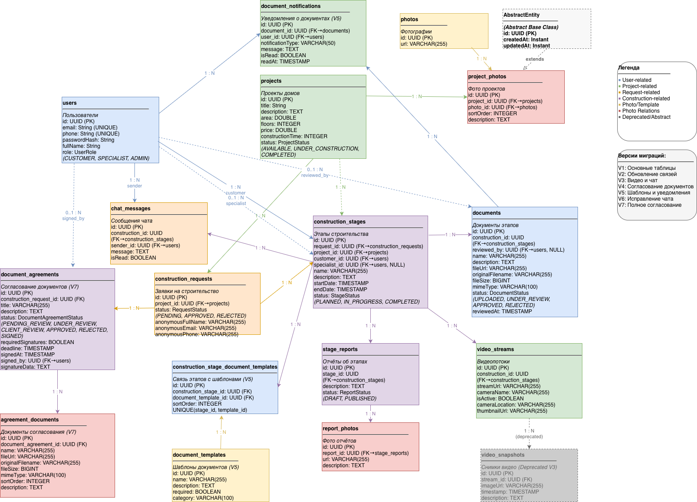

# Backend App — Цифровой сервис ИЖС

Backend-приложение цифрового сервиса для полного цикла индивидуального жилищного строительства (ИЖС), разработанного в рамках хакатона **МосСтройИнформ** командой **Cairos Team (Команда 29)**.

Проект реализует единое цифровое пространство взаимодействия между заказчиком и строительной компанией — от выбора проекта дома до подписания финальных документов после завершения строительства.

---

## 🏗 О проекте

Партнёр кейса — **Мосстройинформ**.  
Задача — разработать мобильное приложение или веб-сервис, который сопровождает пользователя на всех этапах строительства ИЖС:

1. Выбор проекта
2. Согласование документации
3. Этап строительства (видеопоток + чат)
4. Завершение строительства и подписание документов

В качестве продуктового аналога использовалось приложение **Good Wood**.

Backend отвечает за бизнес-логику, хранение данных, работу с документами, видеопотоками и real-time взаимодействие.

---

## 🎯 Целевая аудитория

- Люди, планирующие строительство загородного дома
- Пользователи, которым нужен единый цифровой инструмент для:
  - выбора проекта
  - согласования документов
  - контроля хода стройки
  - общения со специалистами
  - подписания финальных документов

---

## 🚀 Основной функционал backend

- Авторизация пользователей
- Управление проектами домов
- Оформление заявок на строительство
- Управление статусами строительства
- Документооборот (договоры, сметы, акты)
- Подписание документов
- Видеопотоки со стройки
- **Real-time** чат (WebSocket)
- Уведомления о статусах и событиях
- Хранение файлов в **MinIO**

---

## 🔄 Пользовательские сценарии (User Flows)

### 1. Выбор проекта и заявка
- Получение списка проектов
- Просмотр детальной карточки проекта
- Отправка заявки на строительство

### 2. Согласование документации
- Привязка документов к этапам строительства
- Статусы документов:  
  `Не загружено / На проверке / Одобрено / Требуются исправления`
- Подготовка к старту стройки

### 3. Этап строительства
- Просмотр видеопотока с камер
- Переключение между камерами
- Общение с менеджером / прорабом в чате
- Отслеживание прогресса этапов

### 4. Завершение строительства
- Финальные документы
- Подписание актов
- Переход в статус «Гарантия»

---

## 🧩 Архитектура и данные

### ER-диаграмма

В проекте используется ER-диаграмма для описания структуры данных и связей между сущностями.

---

## 🛠 Технологический стек

- Backend: **Java / Spring Boot**
- WebSocket — real-time чат
- Streaming — видеопотоки
- Object Storage — **MinIO**
- Авторизация — SMS / Email
- REST API

---

## 📦 Связанные репозитории

- Android-приложение:  
  https://github.com/MSI-hackaton/android_app

---

## 🎥 Демонстрация и прототипы

- **Figma-прототип**  
  https://zebra-visa-09391855.figma.site/  
  _(для просмотра требуется VPN)_

- **Демо пользовательского сценария**  
  https://cloud.mail.ru/public/zrC2/by6Gdkh6Q

- **Скриншоты приложения**  
  https://cloud.mail.ru/public/VEVZ/ceErRffRc

---

## 👥 Команда проекта — Cairos Team

- **Иван Коваленко** — продукт, UX/UI, пользовательские сценарии
- **Иван Косовский** — архитектура backend, Android (ЛК, чат)
- **Александр Струнский** — Android, экраны проектов и заявок
- **Илья Антипов** — backend: видеопотоки, чат, документы
- **Миляуша Швалиева** — backend: авторизация, MinIO

---

## 🏁 Итог

Проект демонстрирует концепцию полного цикла цифрового сопровождения ИЖС, объединяя:

- каталог проектов
- документооборот
- видеонаблюдение
- коммуникацию
- финальное подписание документов

Решение ориентировано на прозрачность, контроль и удобство пользователя и может стать основой для промышленного продукта в сфере частного домостроения.

